#MICRO-BLOG
*Athor_by:yusank* 
经过前前后后20天的时间终于写完了这个小项目，虽然绝大多数的思想和方法都来源于《**Flask Web开发**-基于Python的web开发实践》这本书，但是我在跟着这本书写这个项目的时候遇到了不少的问题，
对于一个没有开发经验，刚开始学Python的我来说是也算是一个挑战。遇到的问题经过Google和向高手询问，最终写出了这个项目。 
实现的功能包括了注册，登录，邮箱验证，用户角色（管理员，普通用户，协管员），自动生产头像，更改资料，更改邮箱，更改密码，发表文章（支持markdown以及预览）。
关注其他用户，对文章的评论，更改已发表的的文章，查看关注用户的文章等。 
管理员可以改变任何人的资料和发表的文章以及使不当的评论设为不可见。 
协管员可以管理评论。 
下面放几张效果图： 
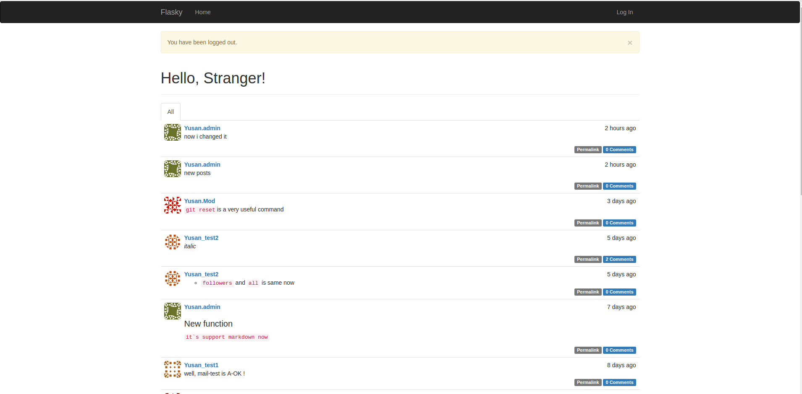 
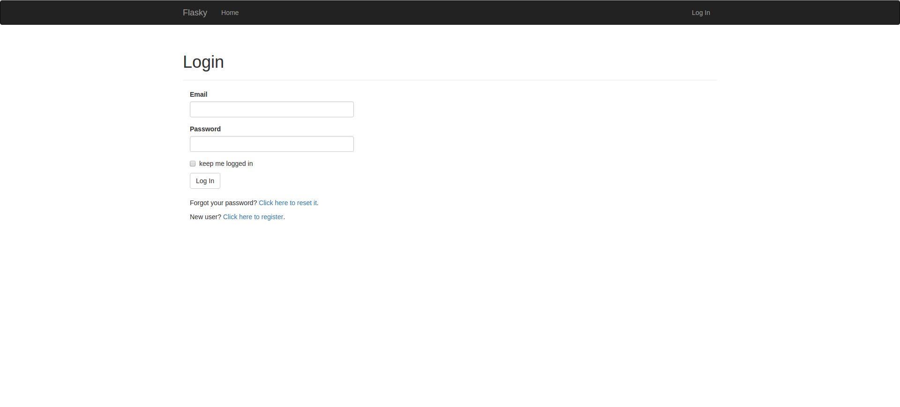 
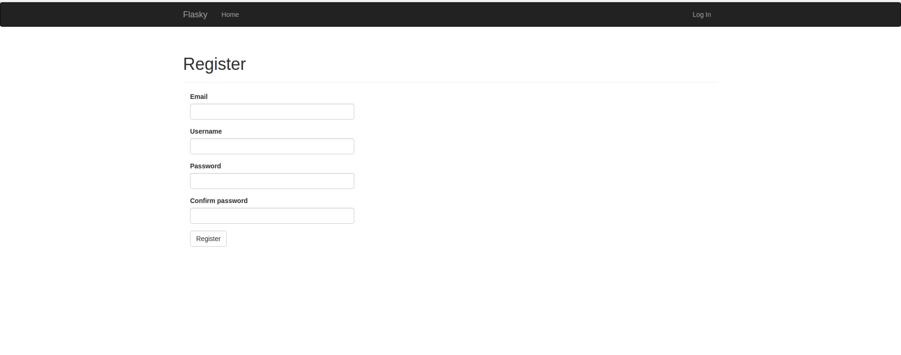 
**通过右上角的选项可以打开修改邮箱和密码的界面，修改邮箱的时候还得认证一次新的邮箱**
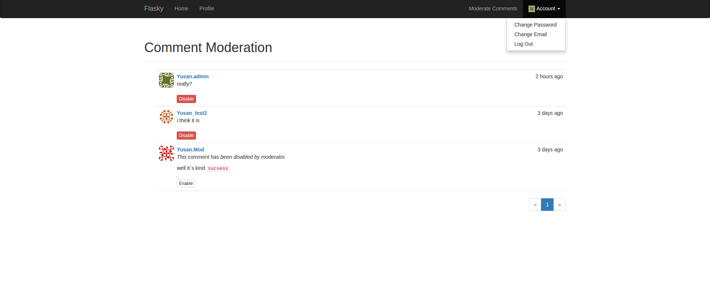 
**注册新用户的时候会收到这种邮件，从邮件里的URL登录flasky才能认证通过**
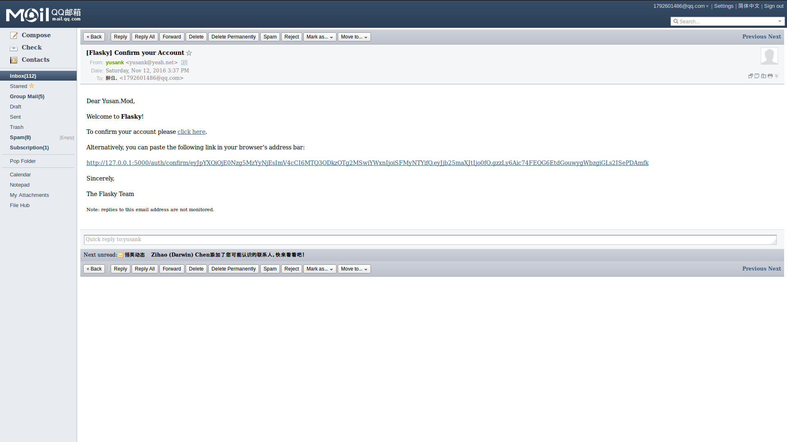 
**白色的按钮所有的用户资料界面都显示以此来修改自己的基本信息，红色按钮只会在管理员自己的资料界面和管理员打开其他用户资料的时候出现，用来改用户的任何信息，包括权限**
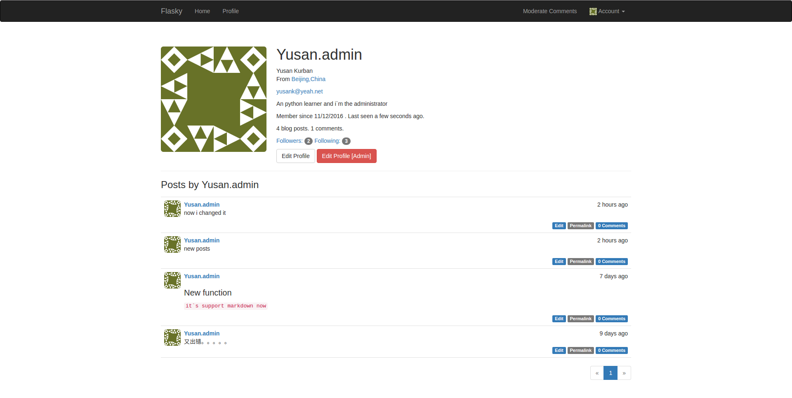 
**管理员修改其他用户资料**
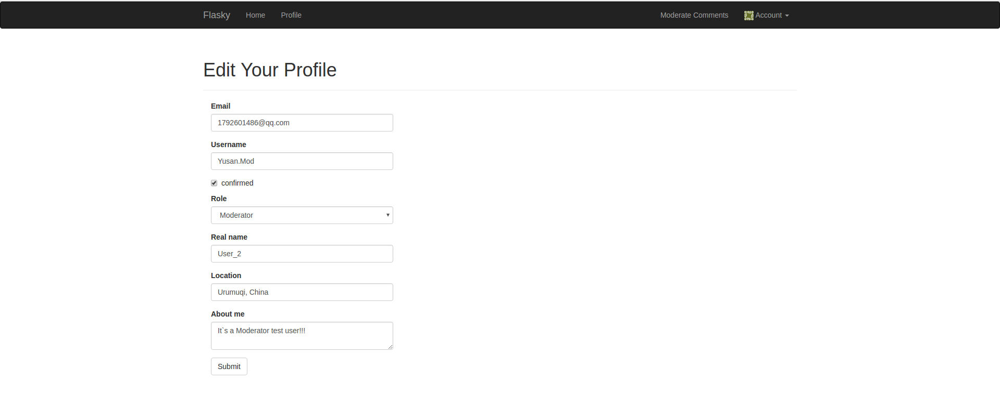 
**打开其他用户资料界面的时候，如果还没关注过此用户则出现`Follow`的按钮，否则出现`Unfollow`（不再关注）的按钮**
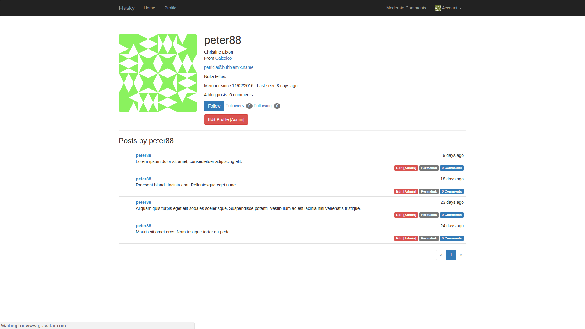 
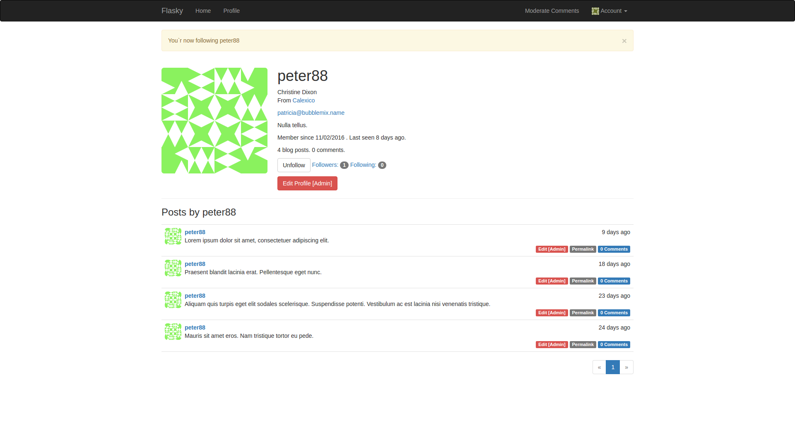 
**主页会有两个分页一个是`all`另一个是`Followers`，分别显示全部文章和关注的用户发表的文章（自己默认关注自己） **
**下图的第四第五个文章就是通过markdown语法来写的，在上面的输入框输入文字，下面会自动出现预览框**
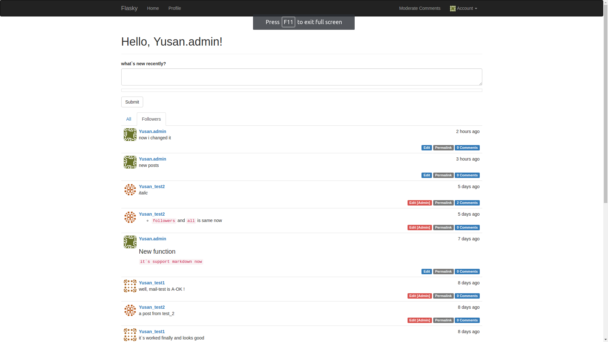 
**管理员和协管员通过按下右上角的`moderate commnets`按钮（普通用户看不到此按钮）来管理评论，并给不当评论给予不显示**
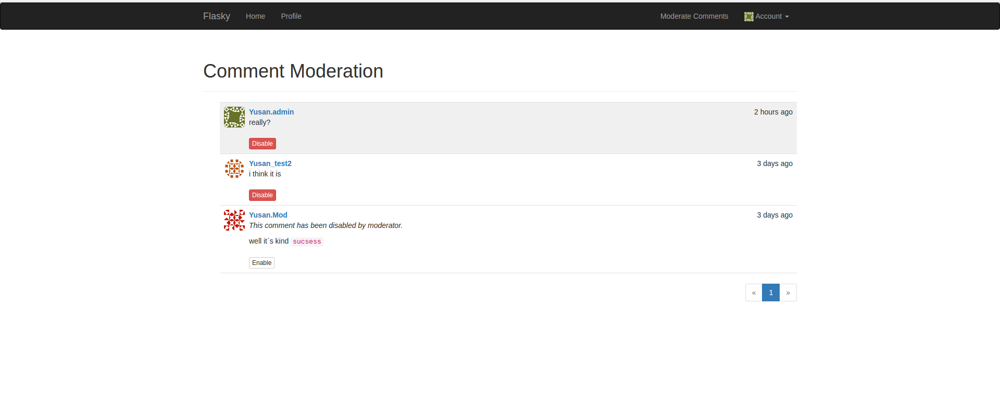 
在前端用了bootstrap框架，因此在手机上看的效果可以如下 
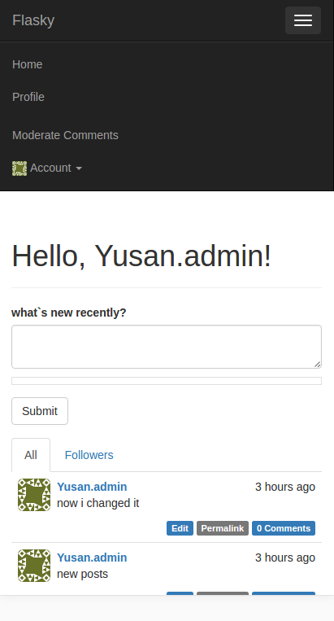 
除了以上的功能外，本项目还提供了一些API，可以为客户端提供服务。以下为客户端的测试（在terminal模拟客户端） 
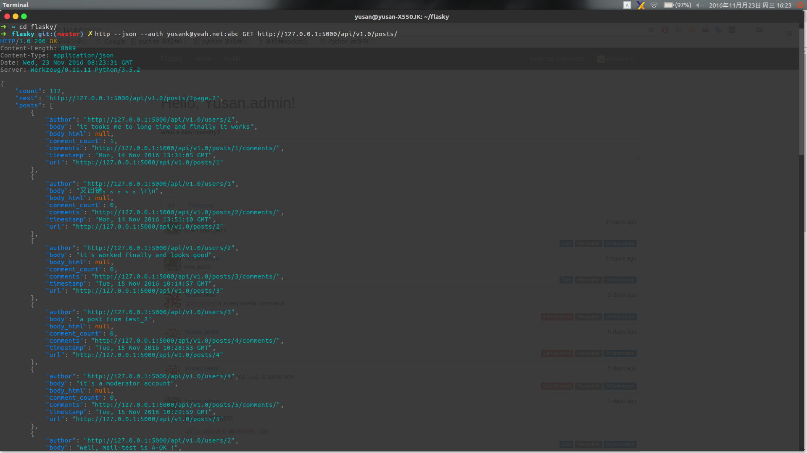 
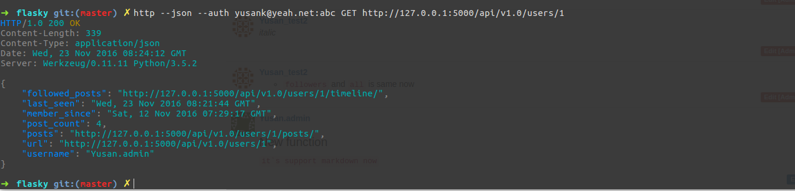 
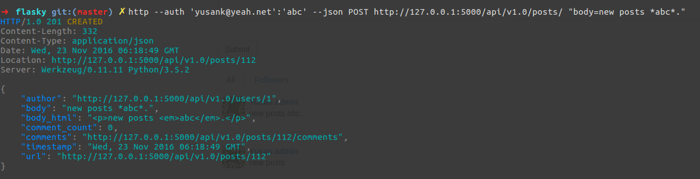 
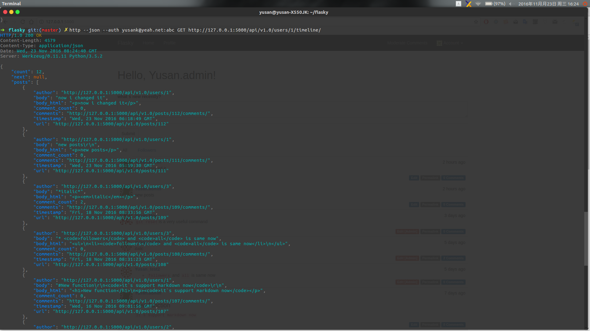 
在这儿并没有展示所有的功能，感兴趣的朋友可以克隆下来试试，有什么我们要发现的问题，如果大家发现了，希望给予提醒！！！
